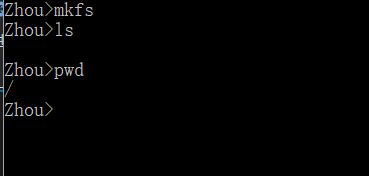
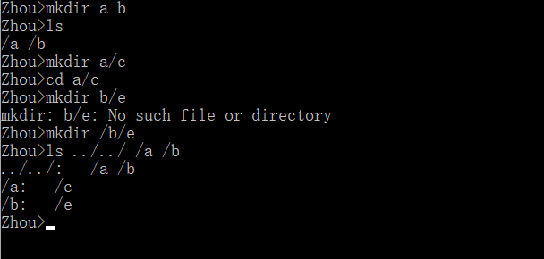
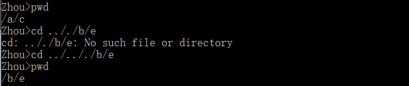
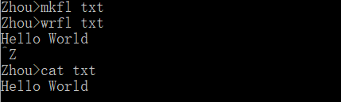
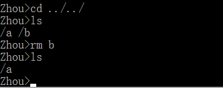

# 操作系统作业3：简单文件系统的实现
***
## 特点
* 支持绝对路径和相对路径
* 大部分指令与Linux文件指令命名一致
* 使用大文件模拟硬盘，编写驱动api模拟与硬盘的交互
* 可通过修改驱动api移植到不同平台
## 支持操作
### 格式化
* 指令格式```mkfs```
* 作用：将文件系统格式化

### 创建目录
* 指令格式```mkdir dir1Name1 dirName2...```
* 作用：根据输入参数创建目录

### 显示目录
* 指令格式```ls dir1Name1 dirName2...```
* 作用：根据输入参数显示目录下的所有文件和子目录，若无输入参数，则显示当前目录下的文件与子目录

### 显示当前目录
* 指令格式```pwd```
* 作用：显示当前用户所处的目录

### 更改当前路径
* 指令格式```cd dirName```
* 作用：移动到dirName目录下，若无输入参数，移动到根目录下

### 删除文件或目录
* 指令格式```rm name1 name2...```
* 作用：删除输入参数所示的文件或目录，删除目录时则会删除该目录下的所有目录或文件

### 创建文件
* 指令格式```mkfl fileName1 fileName2...```
* 作用：根据输入参数创建文件

### 写文件
* 指令格式```wrfl filename```
* 作用：执行指令后，用户输入文件内容，以EOF作为结束标志

### 读文件
* 指令格式```cat fileName1 fileName2...```
* 作用：显示出输入参数所指向的文件的内容

### 打开文件/关闭文件
* 以系统调用的形式存在，不直接作为指令提供给用户

## 文件系统结构
* 文件系统由位图扇区和文件扇区构成
* 每个扇区大小为512b
* 文件采用链接式存储
* 每个文件扇区由以下三个部分构成
	> 文件头FILE_HEADER
	> 
	> 文件名字
	> 
	> 文件内容

* 文件头FILE_HEADER格式
	> typedef struct File_Header{
	> 
	> int type;
	>	
	> int father_id;
	>   
	> int now_id;
	> 
	> int last_id;
	> 
	> int next_id;
	> 
	> int name_len;
	> 
	> int used_size;
	> 
	> }FILE_HEADER;

	* type:文件类型
	* father_id:所在目录的起始扇区编号
	* now_id:当前文件扇区的编号
	* last_id:上一个文件扇区编号
	* next_id:下一个文件扇区编号
	* name_len:文件名长度
	* used_size:当前扇区已使用空间大小

## 运行界面
* 格式化



* 创建目录



* 更改当前目录



* 创建文件与文件读写



* 删除文件和目录

